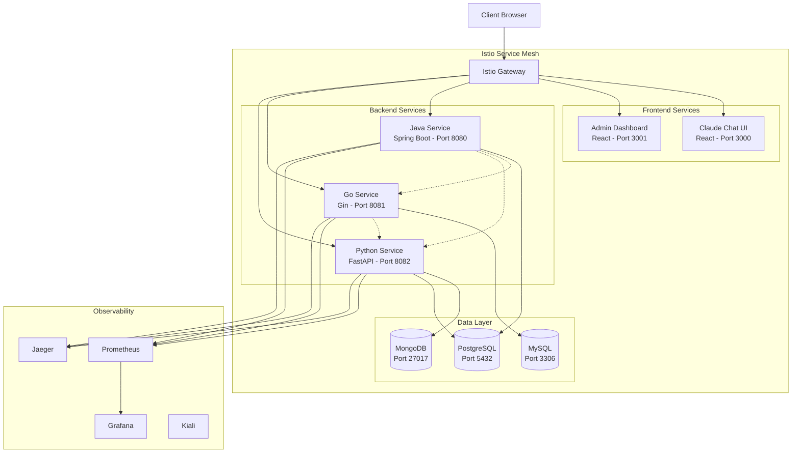

# Architecture Overview

## System Architecture

Everything Portal is a production-ready microservices architecture built on Kubernetes with Istio service mesh.

## Component Overview

### Frontend Layer

#### Claude Chat Interface
- **Technology**: React 18 + TypeScript + Material-UI
- **Port**: 3000
- **Purpose**: Real-time chat interface for user interactions
- **Features**:
  - WebSocket support for real-time messaging
  - State management with Zustand
  - Responsive design
  - API integration with Python service

#### Admin Dashboard (Secondary UI)
- **Technology**: React 18 + TypeScript + Material-UI
- **Port**: 3001
- **Purpose**: Administrative interface and metrics visualization
- **Features**:
  - Service health monitoring
  - Data visualization with charts
  - User management interface
  - System configuration

### Backend Services

#### Java Service
- **Technology**: Spring Boot 3.x + PostgreSQL
- **Port**: 8080 (HTTP), 9090 (gRPC)
- **Database**: PostgreSQL
- **Purpose**: Core business logic and product management
- **Key Features**:
  - RESTful API with Spring WebFlux
  - JPA/Hibernate for data persistence
  - gRPC support for inter-service communication
  - Spring Actuator for health checks and metrics
  - Comprehensive error handling

**Endpoints**:
- `GET /api/java/products` - List all products
- `POST /api/java/products` - Create product
- `GET /api/java/health` - Health check

#### Go Service
- **Technology**: Go + Gin + MySQL
- **Port**: 8081
- **Database**: MySQL with GORM
- **Purpose**: High-performance API operations
- **Key Features**:
  - Lightweight and fast
  - Efficient connection pooling
  - Minimal resource footprint
  - CRUD operations with GORM

**Endpoints**:
- `GET /api/go/items` - List items
- `POST /api/go/items` - Create item
- `GET /api/go/health` - Health check
- `GET /api/go/performance` - Performance test endpoint

#### Python Service
- **Technology**: FastAPI + MongoDB + PostgreSQL
- **Port**: 8082
- **Databases**: MongoDB (primary), PostgreSQL (secondary)
- **Purpose**: Data processing and ML capabilities
- **Key Features**:
  - Async/await with Motor (MongoDB) and AsyncPG (PostgreSQL)
  - Machine learning endpoints
  - Data analysis capabilities
  - RESTful API with automatic documentation

**Endpoints**:
- `GET /api/python/data` - Data management
- `POST /api/python/ml/predict` - ML predictions
- `POST /api/python/ml/analyze` - Data analysis
- `GET /api/python/health` - Health check

### Data Layer

#### PostgreSQL
- **Purpose**: Primary relational database
- **Used By**: Java Service, Python Service
- **Features**:
  - ACID compliance
  - Advanced SQL features
  - Strong consistency
- **Schema**:
  - `java_db` - Product management
  - `python_db` - Data processing

#### MySQL
- **Purpose**: Secondary SQL database
- **Used By**: Go Service
- **Features**:
  - High performance
  - Wide adoption
  - Easy replication
- **Schema**:
  - `go_service` - Items and performance data

#### MongoDB
- **Purpose**: NoSQL document store
- **Used By**: Python Service
- **Features**:
  - Flexible schema
  - High write throughput
  - Document-oriented
- **Collections**:
  - `data_items` - Processing data
  - `ml_models` - ML model metadata

### Service Mesh (Istio)

#### Istio Gateway
- **Purpose**: Entry point for external traffic
- **Features**:
  - Centralized ingress control
  - TLS termination
  - Traffic routing

#### VirtualServices
- **Purpose**: Route traffic to services
- **Routing Rules**:
  - `/chat` → Claude Chat UI
  - `/admin` → Admin Dashboard
  - `/api/java/*` → Java Service
  - `/api/go/*` → Go Service
  - `/api/python/*` → Python Service

#### DestinationRules
- **Purpose**: Traffic policies and load balancing
- **Features**:
  - Circuit breaking
  - Connection pooling
  - Outlier detection
  - Load balancing strategies

### Observability Stack

#### Prometheus
- Metrics collection from all services
- Query language for metrics analysis
- Alert rule evaluation

#### Grafana
- Visualization dashboards
- Custom metrics displays
- Alert notifications

#### Jaeger
- Distributed tracing
- Request flow visualization
- Performance analysis

#### Kiali
- Service mesh visualization
- Traffic flow monitoring
- Configuration validation

## Communication Patterns

### Synchronous Communication
- **REST APIs**: Primary communication method
- **gRPC**: High-performance service-to-service calls (Java Service)
- **HTTP/JSON**: Standard for frontend-backend communication

### Service Discovery
- Kubernetes DNS for service discovery
- Istio for advanced routing and load balancing

### Data Flow Example

1. User sends request through browser
2. Request hits Istio Gateway
3. Gateway routes to appropriate service based on path
4. Service processes request and may call other services
5. Service interacts with database if needed
6. Response flows back through Istio to client
7. All traffic is observed by Prometheus and Jaeger

## Resilience Patterns

### Circuit Breaking
Istio DestinationRules implement circuit breakers to prevent cascade failures.

### Health Checks
- **Liveness Probes**: Restart unhealthy containers
- **Readiness Probes**: Remove from load balancing when not ready

### Resource Limits
All services have CPU and memory limits to prevent resource exhaustion.

### Retry Logic
Istio automatically retries failed requests with exponential backoff.

## Security

### mTLS (Mutual TLS)
Istio provides automatic mTLS between services (currently PERMISSIVE mode).

### Secrets Management
Kubernetes Secrets for database credentials and sensitive configuration.

### Network Policies
Istio authorization policies control service-to-service communication.

## Scalability

### Horizontal Pod Autoscaling
Services can scale based on CPU/memory utilization or custom metrics.

### Database Scalability
- PostgreSQL: Replication for read scaling
- MySQL: Master-slave replication
- MongoDB: Sharding for horizontal scaling

### Stateless Services
All application services are stateless, enabling easy scaling.

## Deployment Strategy

### Rolling Updates
Kubernetes default deployment strategy for zero-downtime updates.

### Canary Deployments
Istio enables gradual traffic shifting to new versions.

### Blue-Green Deployments
Deploy new version alongside old, then switch traffic.

## Development Workflow

1. Develop service locally
2. Build Docker image
3. Push to registry (or use Minikube's Docker daemon)
4. Deploy to Kubernetes
5. Test through Istio Gateway
6. Monitor with observability tools
7. Iterate based on metrics

## Production Considerations

### For Production Deployment:

1. **Use proper secret management** (Vault, Sealed Secrets)
2. **Enable STRICT mTLS** mode
3. **Set up external databases** (managed services)
4. **Configure ingress** with real domain and TLS
5. **Enable HPA** (Horizontal Pod Autoscaler)
6. **Set up CI/CD** pipelines
7. **Configure alerting** and on-call rotation
8. **Implement backup strategies**
9. **Use multi-zone** deployment for HA
10. **Regular security scanning** of images and code
